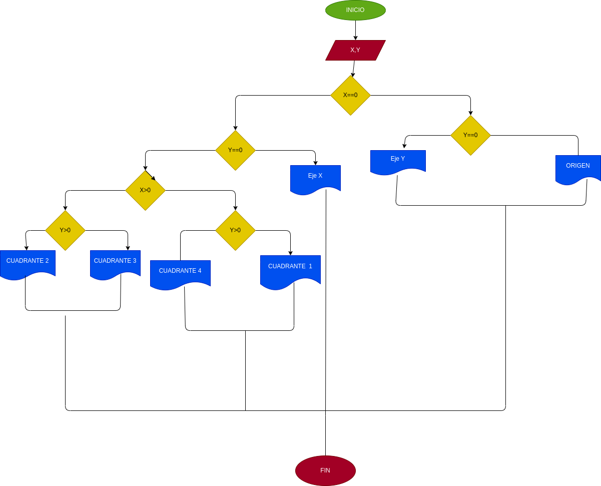

# instruccionescondicionales

# un programa lector de cordenadas  cartecianas (x,y) de un punto en el plano y calcule el cuadrante el cual le pertenece un punto

# ANALISIS

varible de entrada y proceso (input, processing)

x,y: coordenadas del punto

variable de salida 

Eje x
Eje y
Origen 
Cuadrante 1
Cuadrante 2
Cuafrante 3
Cuafrante 4

Nos idica el punto exacto en el plano cartesiano

# DISEÑO

# CONSTRUCCION