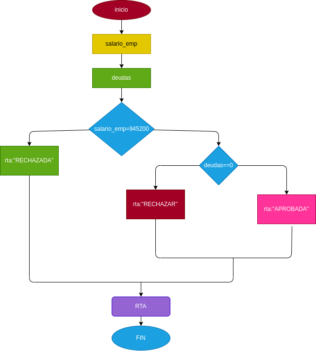

 # prestamo bancario

programa para ver si usted puede adquirir un prestamo en el banco segun su salario y si tiene deudas anteriores

# ANALISIS

Variables de entrada

Salario = el diario necesario para adquirir el prestamo 
Deuda = saber si tiene deudas anteriores

variables de proceso

Salario >= numero ingresado
Deuda = si o no tienes deudas

variables de salida

Aceptado = su prestamo fue aceptado
Denegado = su preestamo fue denegado

Nos indicara si se acepto o se denego su prestamo 

# DISEÑO 

# CONSTRUCCION