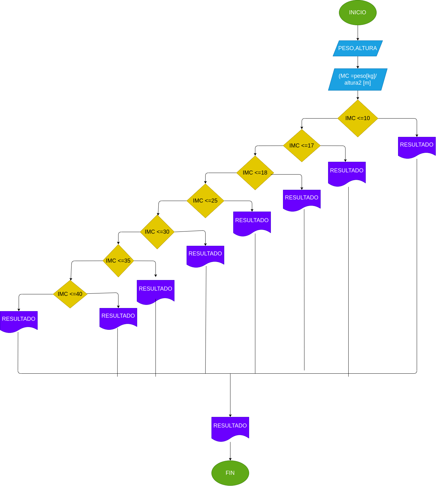

# MASA CORPORAL

programa para saber su masa corporal de acuerdo a su peso y altura

# ANALISIS

variable de entrada (Input)

PESO = Su peso ingresado

ALTURA = Su altura ingresada

Variable de proceso (Processing) 

RESULTADOS = Son los resultados de su indice de peso

variable  de salida (output)

IMC Y RESULTADOS = resutado de su indice de peso y el resultado de estos

# DISEÑO 

# CONSTRUCCION